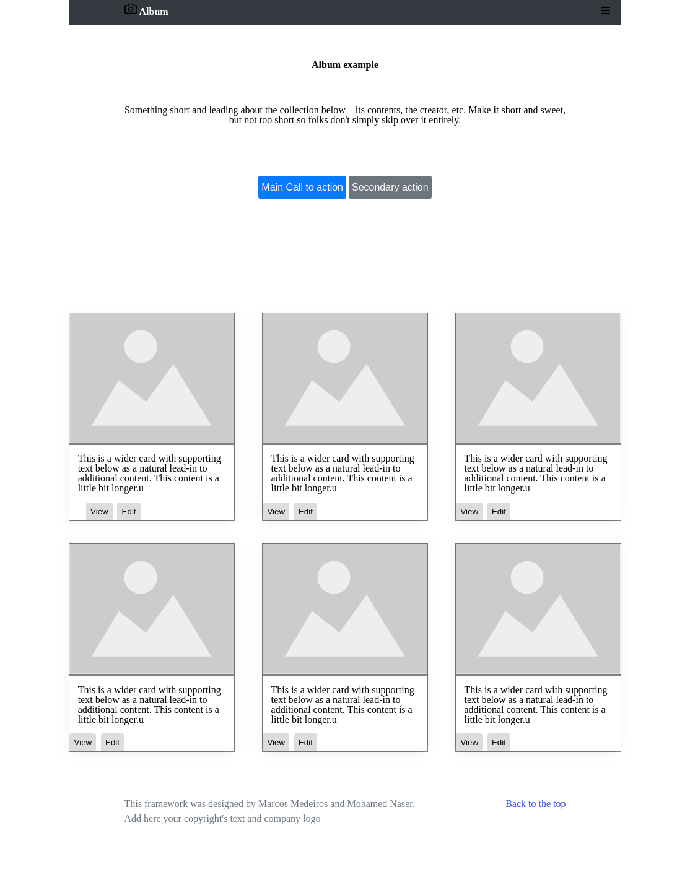
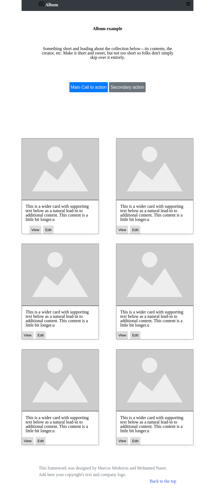
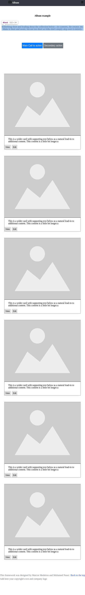

# The Custom CSS FrameWork

The Project is a smaller version of Bootstrap framework we are trying to collect frequently used classes in CSS and build our own CSS  FrameWork. 

## Authors

This project was executed by the duo of :

- [Mohamed Naser](https://www.linkedin.com/in/mohamednaseramein/)
- [Marcos Mederios](https://www.linkedin.com/in/marcos-medeiros-6a079a18a/)

## Used Tools

- HTML
- CSS
- Flex & Grids
- FontAwsome v5.11.2
- MarkDown Syntax
- Gulp
- SAAS
- browser-sync

## Done Work

- [x] Setup project with (Gulp , Gulp Sass , browser-sync)
- [x] Create General Classes For CSS
- [x] Create Header Nav Bar
- [x] Create Albums Section
- [x] Crete footer div
- [x] Use Semintaic HTML
- [x] check CSS with stylelint
- [x] Check html with W3C validator
- [x] Validate Readme file with markdown lint

## Setup

Open your git bash and cd to the location you'd like to put your files the run the command below.

```console
git clone https://github.com/mohamednaser/custom-css-framework.git
```

## Live Version

Live version [here](https://mohamednaser.github.io/custom-css-framework/)

## ScreenShot For Page

### ScreenShot In Desktop Screen



### ScreenShot In Screen < 960px (Meduim Screen )



### ScreenShot In Screen < 670px (Small Screen )


